# Help Desk Administrator Homelab
## Ticketing (Peppermint + Docker) + Active Directory + Windows 11

This project documents a simulated **Help Desk environment** built while completing the **TCM Security Practical Help Desk Administrator course**.

It includes:
- A **ticketing system** (Peppermint) deployed with **Docker** to track IAM and AD tickets
- An **Active Directory domain** (Windows Server Domain Controller)
- A **Windows 11** domain-joined workstation

---

## Lab Architecture (Visual)

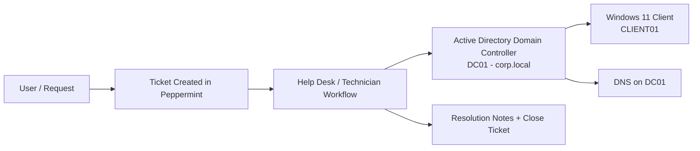

---

## Environment Details

**Domain:** `corp.local`

**Domain Controller**
- OS: Windows Server 2019
- Hostname: `DC01`
- IP: `192.168.1.10`
- Roles: AD DS, DNS

**Client**
- OS: Windows 11
- Hostname: `CLIENT01`
- Role: Domain-joined workstation

**Ticketing**
- Peppermint Ticket Management System
- Deployed using Docker

---

# Part 1 — Ticketing System Lab (Peppermint)

### Section Topics Covered (from course)
- Ticketing – Section Intro
- Installing Docker and Peppermint
- Configuring Peppermint
- Creating, Commenting, Assigning and Closing Tickets

---

## Step 1 — Install Docker + Deploy Peppermint (Visual)

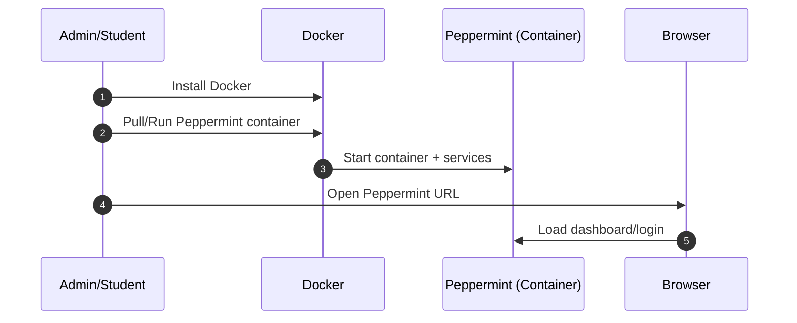

**Outcome:** Peppermint is running and accessible via browser.

---

## Step 2 — Configure Peppermint (Visual)

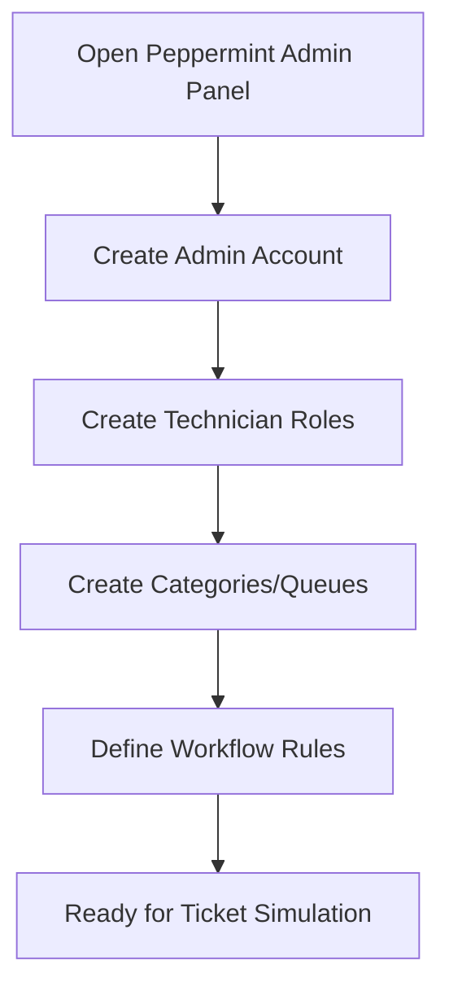

**Example categories/queues**
- IAM Requests
- Active Directory Issues
- Password Resets
- Workstation Support

---

## Step 3 — Ticket Lifecycle Practice (Visual)

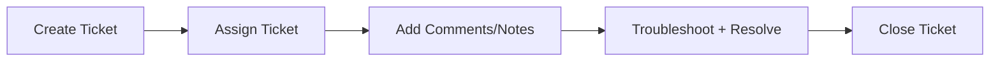

---

## Example Tickets (Used in this Lab)

- Ticket 001 — Create new user account
- Ticket 002 — Password reset request
- Ticket 003 — Account locked out
- Ticket 004 — Workstation cannot join domain
- Ticket 005 — User cannot log in (domain login troubleshooting)

---

# Part 2 — Active Directory Lab

## Step 1 — Create Virtual Machines (Visual)

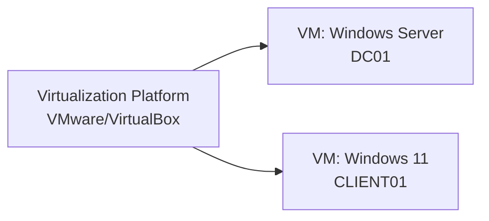

**Recommended resources**
- DC01: 4GB RAM, 2 CPU, 60GB disk
- CLIENT01: 4GB RAM, 2 CPU, 60GB disk

---

## Step 2 — Configure Static IP on DC01 (Visual)

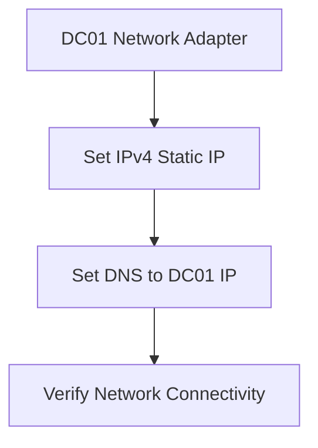

**Example configuration**
- IP: `192.168.1.10`
- Subnet: `255.255.255.0`
- Gateway: `192.168.1.1`
- DNS: `192.168.1.10`

---

## Step 3 — Install AD DS Role (Visual)

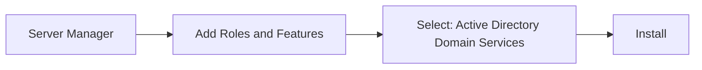

**Outcome:** AD DS role installed on DC01.

---

## Step 4 — Promote to Domain Controller (New Forest) (Visual)

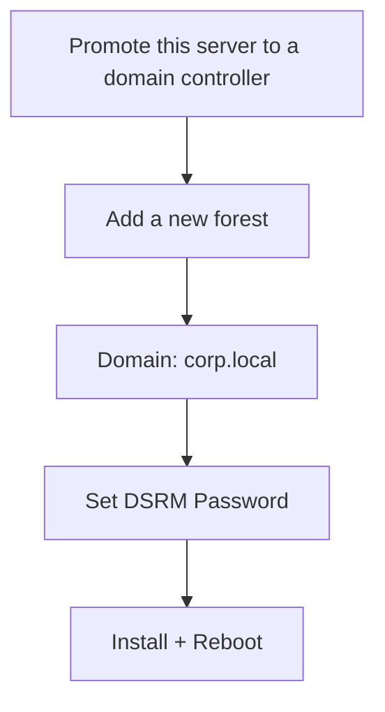

**Outcome:** DC01 becomes Domain Controller + DNS for `corp.local`.

---

## Step 5 — Create OU Structure (Visual)

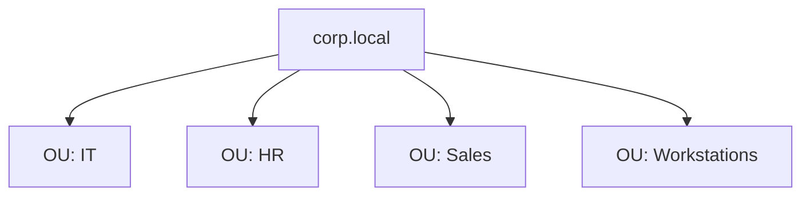

**Outcome:** Clean structure for managing users and devices.

---

## Step 6 — Create Domain Users (Visual)

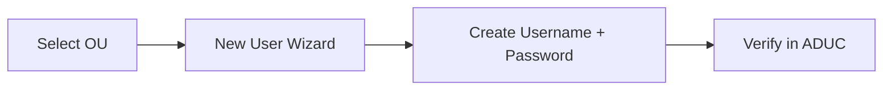

**Example users**
- `jsmith` (John Smith)
- `adoe` (Alice Doe)
- `mjones` (Michael Jones)

---

## Step 7 — Join Windows 11 to the Domain (Visual)

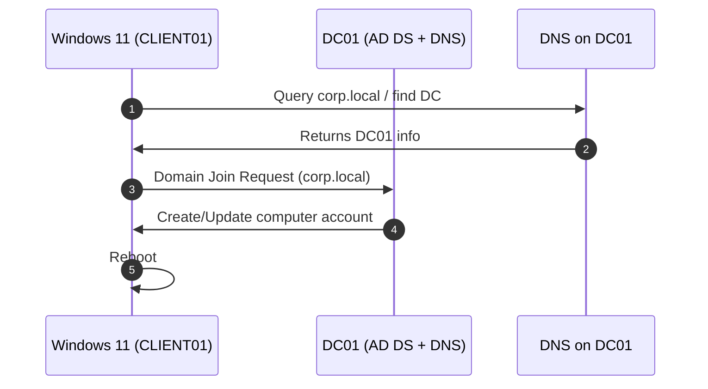

**Outcome:** CLIENT01 is domain joined to `corp.local`.

---

## Step 8 — Group Policy Example (Visual)

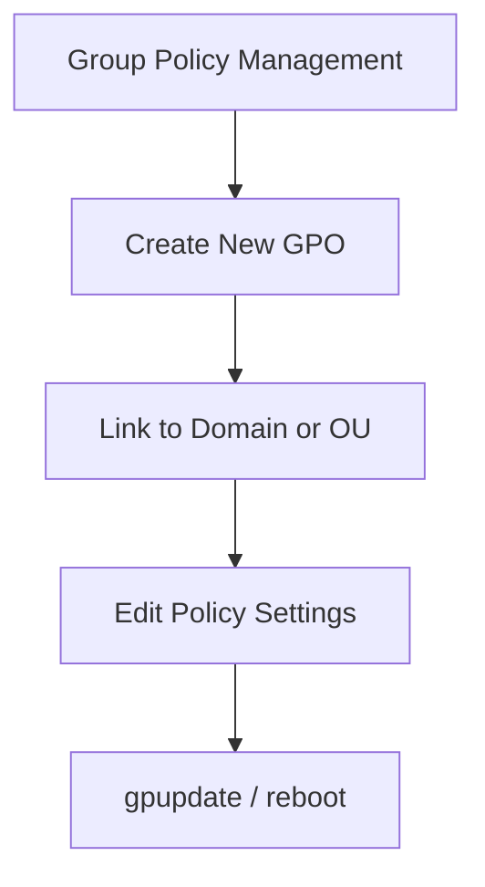

**Example policy**
- Disable Control Panel Access  
Path:
- User Configuration → Administrative Templates → Control Panel → Prohibit access to Control Panel → **Enabled**

---

# Ticket-to-Resolution Example (Visual + Narrative)

**Resolution steps**
1. Locate user account in ADUC  
2. Unlock account  
3. Reset password (if required)  
4. Document the fix in Peppermint  
5. Close the ticket

---

# Skills Demonstrated

- Help Desk ticket management (creation, assignment, documentation, closure)
- IAM workflow simulation
- Active Directory administration (AD DS, DNS, users, OUs)
- Windows 11 domain join + troubleshooting
- Group Policy configuration
- Virtual lab deployment (VMware/VirtualBox)

---

# Future Improvements

- File shares + NTFS permissions
- PowerShell automation (bulk users, resets, reporting)
